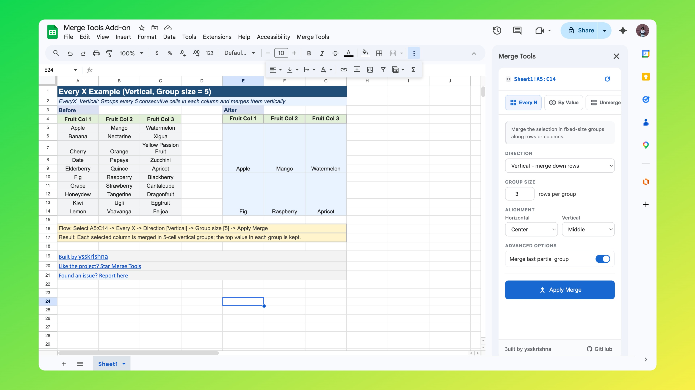
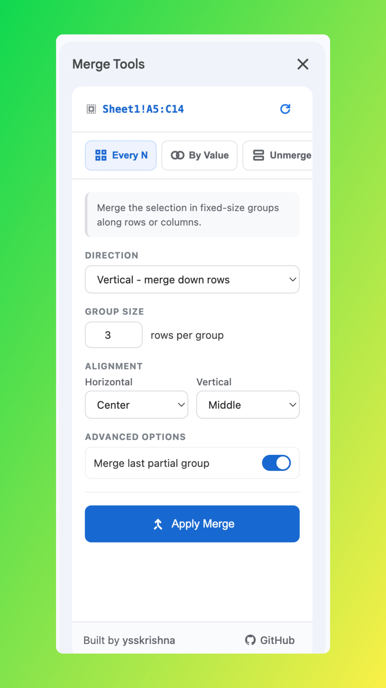
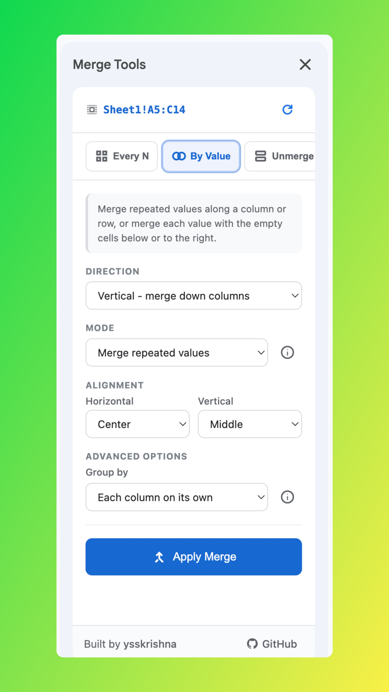
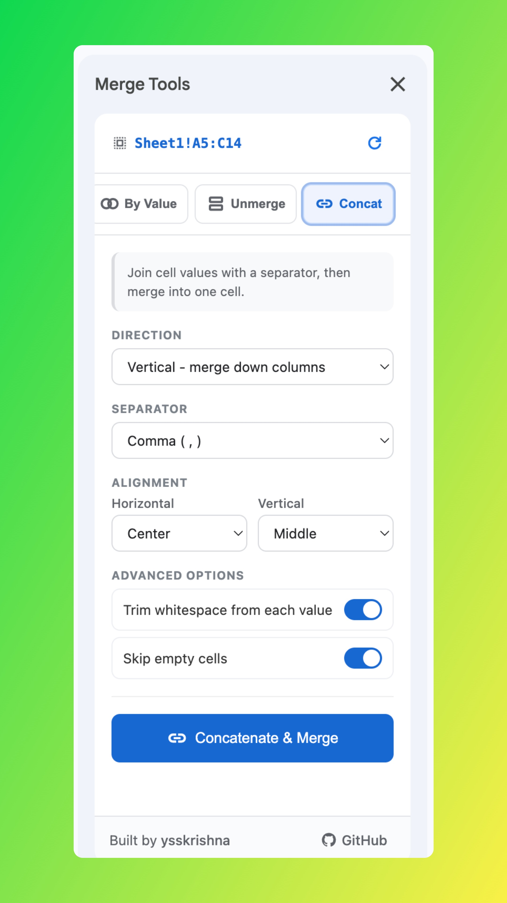

# Merge Tools for Google Sheets

 

Merge Tools is a powerful yet simple Google Sheets add-on that saves you hours of tedious manual work. Whether you need to merge cells by fixed group size, by repeated values, combine multiple cells with separators, or cleanly unmerge cells while preserving data, Merge Tools does it all from an intuitive sidebar.

## Key Features

### 1. Merge Every "N" Cells

Merge your selection into fixed-size groups along rows or columns.

- **Group size:** Define exactly how many cells form each merged block.
- **Last partial group:** Choose whether to merge or leave the last partial group cells at the end.

### 2. Merge By Value

Smart merging based on cell content — ideal for grouping repeated cells.

- **Merge repeated values:** Automatically detect and merge consecutive cells with the same value (vertically or horizontally).
- **Merge value with empty cells:** Extend a value across adjacent blank cells until the next non-empty cell.

**Advanced grouping:**
- *Each column on its own* — Every column decides its merge pattern independently. 
- *All columns follow the first* — The first column sets the merge pattern, and all other columns mirror it exactly.

### 3. Unmerge

Quickly split merged cells in your selection.

- **Optional:** Automatically fill every split cell with the original merged value so no data is lost.

### 4. Concatenate & Merge

Combine multiple cell values into one cell with your chosen separator, then merge them.

- **Separators**: Comma, semicolon, pipe (|), dash, newline, or any custom character.
- **Trim whitespace** — Clean extra spaces from each value before joining.
- **Skip empty cells** — Prevent blank cells from creating unwanted gaps.

**Common Merge Options**

- **Direction:** Work **vertically** (down columns) or **horizontally** (across rows).
- **Alignment:** Set both horizontal alignment (left, center, right) and vertical alignment (top, middle, bottom) for the merged cells.

## Why users love Merge Tools?
- Saves significant time on repetitive formatting tasks
- Preserves data integrity
- Clean, professional-looking results with minimal effort
- Works directly inside Google Sheets with a simple sidebar interface

## [Merge Tools — Examples Workbook](https://docs.google.com/spreadsheets/d/10Nn5sSyi84XuD_TqrhX-jOcTBQBuQLZO4RbJDzLHvhI/edit?gid=49837453#gid=49837453)

A public Google Sheet demonstrates each mode with a real **Before → After** layout.

| Sheet (tab) | What it shows |
| --- | --- |
| `EveryX_Vertical` | Groups every 5 consecutive cells in each column and merges them vertically |
| `EveryX_Horizontal` | Groups every 5 consecutive cells in each row and merges them horizontally |
| `EveryX_Leftover` | Compares leaving vs. merging the leftover rows when the total count isn't a multiple of the group size |
| `ByValue_Repeat_Vertical` | Looks down each column and merges runs of identical values into one cell |
| `ByValue_Repeat_Horizontal` | Looks across each row and merges runs of identical values into one cell |
| `ByValue_Blanks` | Extends each cell's merge region to cover all consecutive empty cells that follow it |
| `UnmergeFill` | Breaks merged cells into individual cells, filling each one with the original merged value |
| `Concat_Vertical` | Combines cell values down each column into a single comma-separated string, then merges |
| `Concat_Horizontal` | Combines cell values across each row into a single delimited string, then merges |

**Tip:** Each example uses a selected **range** (multiple rows and/or columns), not a single row only—select a similar area in your own sheet when reproducing the behavior.

## Links

- **Home**: [https://ysskrishna.github.io/google-sheets-merge-tools/](https://ysskrishna.github.io/google-sheets-merge-tools/)
- **Changelog**: [https://ysskrishna.github.io/google-sheets-merge-tools/changelog.html](https://ysskrishna.github.io/google-sheets-merge-tools/changelog.html)
- **Terms of Service**: [https://ysskrishna.github.io/google-sheets-merge-tools/terms.html](https://ysskrishna.github.io/google-sheets-merge-tools/terms.html)
- **Privacy Policy**: [https://ysskrishna.github.io/google-sheets-merge-tools/privacy.html](https://ysskrishna.github.io/google-sheets-merge-tools/privacy.html)
- **Support**: [https://ysskrishna.github.io/google-sheets-merge-tools/support.html](https://ysskrishna.github.io/google-sheets-merge-tools/support.html)

## Screenshots

## Author

Built and maintained by **Y. Siva Sai Krishna**.

[Author's GitHub](https://github.com/ysskrishna) • [Author's LinkedIn](https://www.linkedin.com/in/ysskrishna) • [Website](https://ysskrishna.github.io/google-sheets-merge-tools/) • [Merge Tools — Examples Workbook](https://docs.google.com/spreadsheets/d/10Nn5sSyi84XuD_TqrhX-jOcTBQBuQLZO4RbJDzLHvhI/edit?gid=49837453#gid=49837453)

